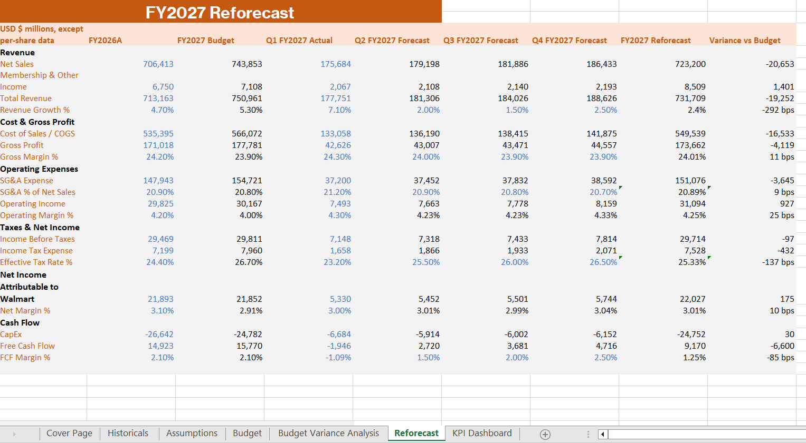

# Walmart Quarterly FP&A Reporting Dashboard & Reforecast Model

This project is a Walmart FP&A reporting model built in Excel. The workbook analyzes Walmart’s historical performance, develops an FY2027 budget, compares the budget against FY2026 actuals, builds a quarterly FY2027 reforecast, and summarizes the results in a KPI dashboard.

The purpose of the project is to demonstrate core FP&A skills including historical analysis, budget development, variance analysis, reforecasting, KPI reporting, and management commentary.

## Project Overview

The model follows a typical FP&A workflow:

1. Collect historical financial data
2. Build assumptions and budget drivers
3. Create an FY2027 budget
4. Compare FY2027 budget vs FY2026 actuals
5. Build an FY2027 reforecast using Q1 actuals and Q2–Q4 forecast assumptions
6. Analyze variance drivers
7. Present results in a KPI dashboard

## Workbook Sections

### Cover Page

The cover page introduces the project, company, data sources, currency, model period, and purpose.

---

### Historical Financial Data

The historical section includes Walmart’s income statement, cash flow, free cash flow, and segment performance from FY2023A to FY2026A. These historical actuals were used as the foundation for budget assumptions and trend analysis.

---

### Assumptions / Budget Drivers

The assumptions sheet calculates historical averages for key FP&A drivers such as revenue growth, gross margin, SG&A as a percentage of net sales, operating margin, effective tax rate, CapEx as a percentage of revenue, and free cash flow margin.

These historical averages were used to support the FY2027 budget assumptions.

---

### FY2027 Budget

The FY2027 budget was built using FY2026 actual results as the base year and applying budget assumptions from the assumptions sheet.

Key budget drivers included:

* Revenue growth
* Gross margin
* SG&A as a percentage of net sales
* Effective tax rate
* CapEx as a percentage of revenue
* Free cash flow margin

---

### Budget Variance Analysis

The budget variance analysis compares FY2027 budget results against FY2026 actual results. The sheet includes dollar variance and percentage / basis point variance to explain year-over-year changes.

This section highlights the impact of revenue growth, gross margin movement, SG&A efficiency, tax rate changes, and free cash flow performance.

---

### FY2027 Reforecast

The reforecast combines Q1 FY2027 actual results with updated Q2–Q4 forecast assumptions to create a revised full-year FY2027 outlook.

The reforecast answers the question:

> Based on actual Q1 performance and updated assumptions, where is Walmart expected to finish FY2027 compared to the original budget?

---

### KPI Dashboard

The KPI dashboard summarizes the most important budget vs reforecast metrics. It includes KPI tables, chart data, margin comparisons, variance drivers, and written commentary.

Key dashboard metrics include:

* Total Revenue
* Net Sales
* Operating Income
* Net Income
* Free Cash Flow
* Gross Margin
* SG&A % of Net Sales
* Operating Margin
* Effective Tax Rate
* Net Margin
* FCF Margin

## Key Findings

The FY2027 reforecast shows Walmart tracking below the original revenue budget, with total revenue projected below plan due to weaker net sales. However, profitability is expected to outperform budget because of stronger gross margin, lower SG&A dollars, and a favorable effective tax rate.

Free cash flow is the main weakness in the reforecast, coming in below budget due to weak Q1 cash flow performance. Overall, the model shows a mixed outlook: sales and cash flow are below plan, but margins and earnings are stronger than expected.

## Skills Demonstrated

* Financial Planning & Analysis
* Budgeting and forecasting
* Variance analysis
* Reforecast modeling
* KPI dashboard creation
* Historical financial analysis
* Management commentary
* Excel formulas and formatting
* Margin and basis point analysis
* Free cash flow analysis

## File

[Download the Excel Workbook](Walmart%20Quarterly%20FP%26A%20Reporting%20Dashboard%20%26%20Reforecast%20Model%281%29.xlsx)

## Tools Used

* Microsoft Excel
* Walmart public filings and investor relations materials
* Financial statement analysis
* FP&A modeling techniques

## Notes

All figures are shown in USD millions unless otherwise stated. The FY2027 budget and Q2–Q4 reforecast assumptions are model-driven estimates created for FP&A analysis purposes.
